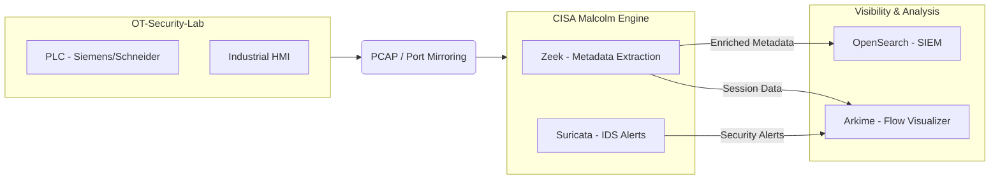
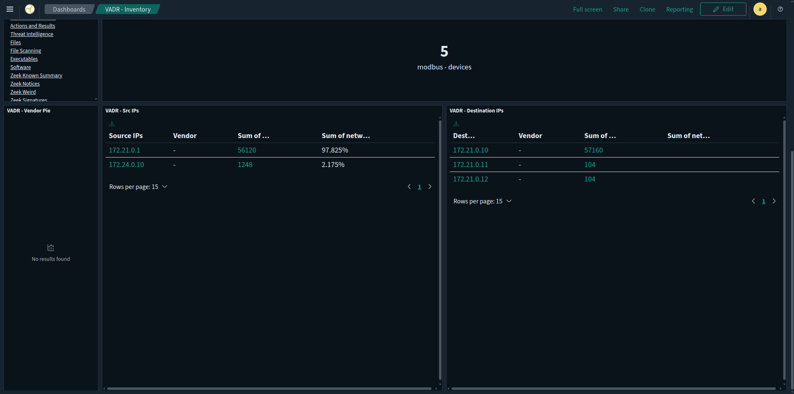
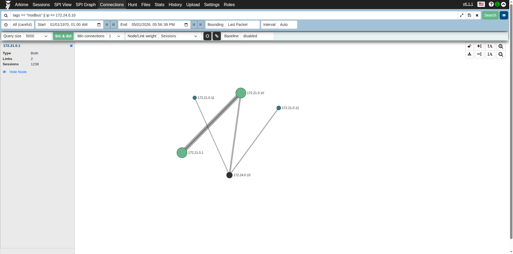

# OT Network Detection & Response (NDR) Pipeline using CISA Malcolm

[](https://opensource.org/licenses/MIT)
[](https://malcolm.fyi/)

## Objective
To emulate the Continuous Threat Detection (CTD) and passive asset visibility of commercial platforms like Nozomi Networks and Claroty using open-source tools. This project demonstrates a production-grade pipeline for industrial network security, specifically focused on Deep Packet Inspection (DPI) of the Modbus TCP protocol within a Purdue-model environment.

## Visual Architecture


## Architecture Overview
The pipeline ingests raw network traffic (PCAPs) from a simulated Industrial Control System (ICS) environment, processing it through a multi-stage analysis stack:

1.  **Traffic Capture:** Real-time capture of Modbus TCP traffic between HMIs and PLCs.
2.  **Ingestion:** Automatic processing via **CISA Malcolm**.
3.  **Analysis:** Protocol decoding and SPI (Stateful Packet Inspection) via **Arkime**.
4.  **Detection:** Alert generation via **Suricata** IDS with custom industrial rules.
5.  **Visibility:** Asset discovery and threat hunting via **OpenSearch** dashboards.

---

## Visual Proof of Pipeline Performance

### Passive Asset Discovery (OpenSearch)
Malcolm automatically identifies assets by analyzing traffic patterns. The dashboard below demonstrates the automated discovery and fingerprinting of PLC and HMI nodes within the OT environment.


### Lateral Movement Analysis (Arkime)
Using Arkime SPI Graphs, network connections are visualized to identify anomalous traffic flows across Purdue levels. This visualization captures a lateral movement attack attempting to pivot from the operations network into the control zone.


---

## Security Automation (DevSecOps)
To streamline forensic workflows, this project includes a **DevSecOps automation layer**. The custom Python utility enables automated ingestion and validation of lab traffic into the Malcolm analysis engine.

**Key Features:**
- **Automated Ingestion**: Programmatic movement of PCAPs from the lab to the analysis stack.
- **Forensic Chain of Custody**: Automated SHA-256 hashing and persistent audit logging to ensure data integrity during ingestion.
- **ICS-Aware DPI Profiling**: Deep Packet Inspection using `tshark` to analyze Modbus TCP function codes and identify high-risk industrial commands (Write/Control) before analysis.
- **Data Validation**: Pre-ingestion checks to ensure file integrity and protocol compatibility.
- **Pipeline Integration**: Designed to be triggered by network capture hooks or CI/CD pipelines.

```bash
# Example: Automated ingestion of all lab PCAPs
python3 automation/malcolm_ingest.py --all
```

### Pipeline Execution (Visual Proof)
The terminal demo below showcases the automated ingestion process, including forensic hashing, DPI profiling, and real-time detection of unauthorized Modbus control commands.


---

## Key Capabilities Demonstrated
- **Deep Packet Inspection (DPI)**: Analysis of Modbus TCP function codes and register values to detect logic manipulation.
- **Passive Asset Discovery**: Automated identification of PLCs, HMIs, and workstations without active scanning, preserving operational uptime.
- **Detection Engineering**: Development of custom Suricata IDS rules to identify unauthorized ICS commands.
- **Incident Response**: Forensic investigations aligned with NIST SP 800-61 and mapped to the MITRE ATT&CK for ICS matrix.
- **Forensic Verification**: Implementation of SHA-256 chain-of-custody logging for all ingested network evidence.

## Repository Structure
```bash
OT-NDR-Malcolm-Pipeline/
├── README.md                           # Master project summary
├── automation/                         # DevSecOps ingestion & validation scripts
│   ├── malcolm_ingest.py               # Main automation utility
│   └── ingest_audit.log                # Forensic chain-of-custody audit trail
├── pcaps/                              # Raw network traffic data (Baseline vs. Attack)
├── detection-engineering/              # Custom Suricata rules for Modbus
├── dashboards-and-visibility/          # Proof of SIEM/NDR visualization
└── incident-response/                  # NIST-aligned forensic reporting & threat hunting
```

---

## Incident Response and Threat Hunting
The project includes a comprehensive Incident Report documenting a simulated setpoint manipulation attack. Findings are mapped to the MITRE ATT&CK ICS Matrix to provide a standardized view of the threat actor's tactics.

---

## Tech Stack
-   **NDR Framework:** CISA Malcolm
-   **SIEM/Visualization:** OpenSearch / Dashboards
-   **Forensics:** Arkime (Flow Visualization)
-   **IDS:** Suricata (Custom OT Rulesets)
-   **Automation:** Python 3.x
-   **Protocols:** Modbus TCP (ICS/SCADA)
