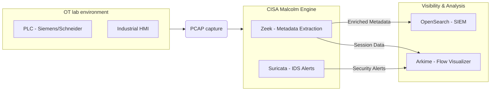
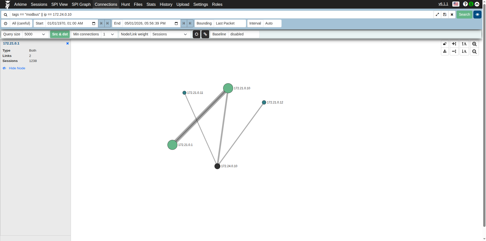

# OT Network Detection & Response (NDR) Pipeline using CISA Malcolm

[](https://opensource.org/licenses/MIT)
[](https://malcolm.fyi/)

## Objective
To build the open-source equivalent of the passive visibility and protocol-aware
triage that commercial OT monitoring platforms provide: ingest industrial
traffic, profile it at the protocol layer, enrich what it finds with asset
context, and produce a defensible incident record. The focus is Modbus TCP in a
Purdue-model lab environment, built on **CISA Malcolm**.

This is a lab pipeline. The [scope and limits](#scope-and-limits) section states
exactly what the committed evidence does and does not prove.

## Visual Architecture

```mermaid
graph LR
    subgraph Lab [OT lab environment]
        direction TB
        PLC[PLC - Siemens/Schneider]
        HMI[Industrial HMI]
    end

    Traffic(PCAP capture)

    subgraph Malcolm [CISA Malcolm Engine]
        direction TB
        Zeek[Zeek - Metadata Extraction]
        Suricata[Suricata - IDS Alerts]
    end

    subgraph Analytics [Visibility & Analysis]
        direction TB
        OS[OpenSearch - SIEM]
        Ark[Arkime - Flow Visualizer]
    end

    Lab --> Traffic
    Traffic --> Malcolm
    Zeek -->|Enriched Metadata| OS
    Suricata -->|Security Alerts| Ark
    Zeek -->|Session Data| Ark
```

## Architecture Overview
The pipeline ingests network traffic (PCAPs) from a simulated Industrial Control
System (ICS) environment and processes it through a multi-stage analysis stack:

1.  **Traffic capture:** Modbus TCP between supervisory hosts and PLCs, committed under `pcaps/`.
2.  **Ingestion:** automatic processing via **CISA Malcolm**.
3.  **Analysis:** protocol decoding and session reconstruction via **Zeek** and **Arkime**.
4.  **Detection:** alert generation via **Suricata**, using the ruleset from [ot-detection-engineering](https://github.com/LiamCarPer/ot-detection-engineering).
5.  **Triage:** deep packet inspection, asset-context enrichment and NIST-aligned reporting via `automation/malcolm_ingest.py`.
6.  **Visibility:** asset discovery and threat hunting in **OpenSearch**.

---

## Detection proof

The ruleset is validated in `ot-detection-engineering`. What this repository adds
is proof that it fires on *this* pipeline's evidence.
`detection-engineering/suricata_check.py` runs the generated ruleset over the
committed captures in a container and records the result:

| Capture | Modbus operations | Suricata result |
| :--- | :--- | :--- |
| `baseline_modbus.pcap` | 610 reads, no writes | **0 alerts** — the benign case stays quiet |
| `modbus_recon_fanout.pcap` | 3 reads across 3 control assets | **0 alerts** — a coverage gap, see below |
| `setpoint_write.pcap` | 6 reads, 1 setpoint-class write | **SID 9000001** fired |

```
"signature": "OT Modbus Write Single Register From Unauthorized Control Writer"
```

Each evidence file records the SHA-256 of both the capture and the ruleset that
produced the alert, so the claim is tied to exact bytes on both sides. See
`detection-engineering/evidence/`.

**The zero on the benign capture is the useful number** — a real
false-positive measurement over committed traffic. **The zero on the enumeration
capture is a gap, not a success:** the ruleset detects control writes and has no
rule for read-only fan-out across control assets, which is the first rule worth
adding.

---

## Visual proof

### Passive asset discovery (OpenSearch)
Malcolm identifies OT assets by analysing traffic patterns rather than scanning.
The dashboard below is the vendor-asset inventory over the committed captures:
five Modbus devices, with the baseline master (`172.21.0.1`) accounting for the
large majority of bytes and the supervisory host a small minority.


**What it proves and what it does not:** the devices are discovered passively and
the relative volumes match the captures. The Vendor column is empty, so this is
discovery, not fingerprinting — no vendor or model was identified.

### Flow analysis (Arkime)
Arkime's SPI Graph shows the same traffic as connections between hosts. The
graph below is the read-only fan-out from `172.24.0.10` to three control assets
in fourteen seconds.


**What it proves and what it does not:** it is a session visualisation of the
committed capture. It is not stateful packet inspection, and the earlier
"lateral movement" description was wrong — the bytes show enumeration, so the
capture and the caption now say so.

---

## Security Orchestration (SOAR)

`automation/malcolm_ingest.py` turns raw ingestion into an automated triage
pipeline:

- **Forensic integrity** — SHA-256 of every artifact, recorded in an append-only
  JSONL audit log (`automation/ingest_audit.log`), one object per ingestion.
- **Protocol-aware DPI** — `tshark` extracts Modbus function codes and reference
  numbers, classifies reads against writes, and flags writes to setpoint-class
  registers (`>= 1000`).
- **Asset-context enrichment** — detected IPs are resolved against
  `automation/asset_inventory.json` for Purdue zone, asset type, criticality and
  owner, and the report states whether the source is an *authorized control
  writer*.
- **Derived ATT&CK mapping** — techniques are asserted from the observed
  operations, so a capture with no control writes cannot produce a report
  claiming a write technique.
- **NIST-aligned reporting** — an incident report per event, generated from
  `incident-response/Incident_Report_Template.md`.
- **Privacy sanitization** — optional `tcprewrite` anonymisation, applied only to
  the copy that ships, never to the evidence that is analysed.

```bash
# Profile a capture and generate a report when a control operation is present
python3 automation/malcolm_ingest.py --file setpoint_write.pcap

# Anonymise the copy that ships to Malcolm
python3 automation/malcolm_ingest.py --file setpoint_write.pcap --sanitize
```

### Pipeline execution (visual proof)

The walkthrough below is a real run against the committed captures: the benign
baseline, the setpoint write and its CRITICAL report, the custody record, and
the rule firing on the same bytes.


The raw recording is committed as `assets/pipeline_demo.cast`, and
`assets/render_cast.py` re-renders it. Note that the demo reads the rule-firing
result from committed evidence; it does not run a live Malcolm instance.

---

## Key Capabilities Demonstrated

- **Deep Packet Inspection (DPI):** Modbus TCP function-code analysis, read/write
  classification, and setpoint-register detection.
- **Detection Engineering:** consumes the validated ICS Suricata ruleset from
  [ot-detection-engineering](https://github.com/LiamCarPer/ot-detection-engineering)
  and proves SID 9000001 fires on committed evidence.
- **Passive Asset Discovery:** identification of PLCs and HMIs from traffic, with
  no active scanning.
- **Asset-Context Enrichment:** Purdue zone, criticality, owner, and write
  authorisation resolved from the asset inventory.
- **Incident Response:** forensic reporting aligned with NIST SP 800-61, mapped
  to MITRE ATT&CK for ICS.
- **Forensic Verification:** SHA-256 chain-of-custody logging in an append-only
  audit log.

## Repository Structure
```bash
OT-NDR-Malcolm-Pipeline/
├── .github/workflows/main.yml          # CI: tests + lint
├── .flake8                             # Lint configuration
├── README.md                           # Master project summary
├── CONTRIBUTING.md                     # Contribution guidelines
├── assets/                             # Demo recording, renderer and its README
├── automation/                         # SOAR orchestration layer
│   ├── malcolm_ingest.py               # Main orchestration engine
│   ├── requirements.txt                # Python dependencies
│   ├── asset_inventory.json            # OT asset database, including write allowlist
│   ├── ingest_audit.log                # Append-only forensic audit trail (JSONL)
│   └── tests/                          # Unit tests and real-capture tests
├── pcaps/                              # Committed captures, generator and manifest
├── detection-engineering/              # Ruleset source, runner and rule-firing evidence
├── dashboards-and-visibility/          # SIEM/NDR visualisation proof
└── incident-response/                  # NIST-aligned forensic reporting
```

## Scope and limits

Stated up front, because they are the interesting part:

- **The captures are lab-generated and small.** `baseline_modbus.pcap` and
  `modbus_recon_fanout.pcap` carry Modbus payloads on bare SYN packets with no
  TCP handshake, so they exercise the DPI profiler and **cannot** exercise any
  `flow:to_server,established` Suricata rule. `setpoint_write.pcap` was built
  with a full handshake for that reason. See `pcaps/README.md`.
- **The write allowlist lives in the asset model.** Authorized control writers
  (`172.21.0.20`, `172.22.0.10`) come from the ruleset's allowlist; the pipeline's
  inventory mirrors it. In a real site both would be exported from one asset
  source of truth.
- **`172.21.0.1`, the baseline master, is not in the asset inventory.** It is
  reported as an unknown asset, which is an honest gap rather than a bug.
- **No live capture path is committed.** The pipeline starts from PCAPs;
  wiring it to a SPAN port or a Malcolm live interface is a deployment step, not
  something this repository demonstrates.
- **No stateful detection.** Every rule is single-event; read-only enumeration is
  visible in the DPI output but nothing alerts on it.
- **The screenshots are not reproducible arithmetic.** They are genuine Malcolm
  and Arkime captures, but their byte totals come from Zeek's connection
  accounting across the ingests recorded in the audit log, so treat them as
  evidence of the device set and its shape, not as a calculation you can redo.
- **The narrative incident report is a tabletop exercise.** The derived reports
  under `incident-response/Incident_Report_*_<capture>.md` are generated from
  data; `Incident_Report_Modbus_Write.md` is a written exercise and says so.

---

## Incident Response and Threat Hunting
`incident-response/` contains both kinds of artifact: reports generated by the
pipeline from the committed captures, a tabletop exercise report, the report
template, and a threat-hunting guide with OpenSearch queries mapped to MITRE
ATT&CK for ICS.

## Tech Stack
-   **NDR Framework:** CISA Malcolm
-   **SIEM/Visualization:** OpenSearch / Dashboards
-   **Flow Analysis:** Arkime
-   **IDS:** Suricata (ICS ruleset from ot-detection-engineering)
-   **Automation:** Python 3.12
-   **Protocols:** Modbus TCP (ICS/SCADA)
