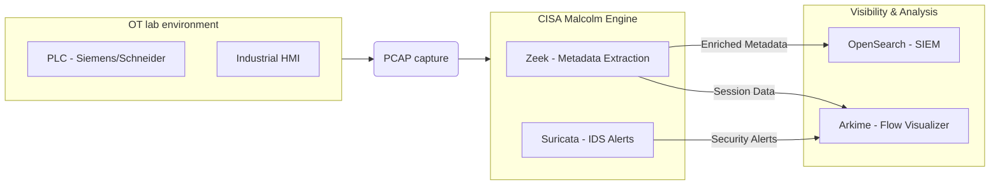
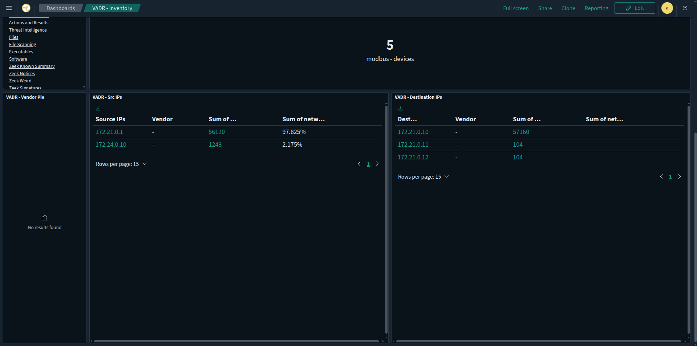
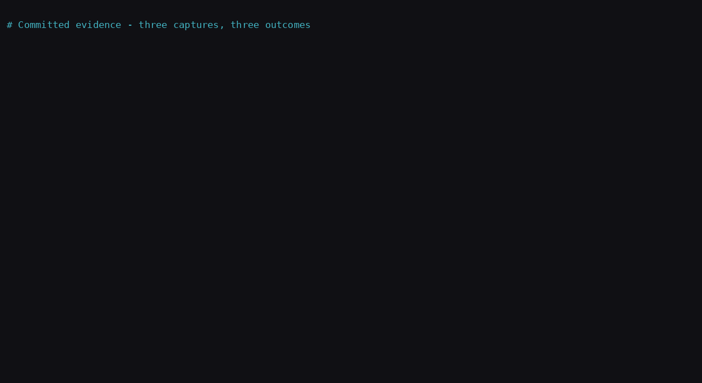

# OT Network Detection & Response (NDR) Pipeline using CISA Malcolm

[](https://opensource.org/licenses/MIT)
[](https://malcolm.fyi/)

## Objective
To build the open-source equivalent of the passive visibility and protocol-aware
triage that commercial OT monitoring platforms provide: ingest industrial
traffic, profile it at the protocol layer, enrich what it finds with asset
context, and produce a defensible incident record. The focus is Modbus TCP in a
Purdue-model lab environment, built on **CISA Malcolm**.

This is a lab pipeline. The [scope and limits](#scope-and-limits) section states
exactly what the committed evidence does and does not prove.

## Visual Architecture

```mermaid
graph LR
    subgraph Lab [OT lab environment]
        direction TB
        PLC[PLC - Siemens/Schneider]
        HMI[Industrial HMI]
    end

    Traffic(PCAP capture)

    subgraph Malcolm [CISA Malcolm Engine]
        direction TB
        Zeek[Zeek - Metadata Extraction]
        Suricata[Suricata - IDS Alerts]
    end

    subgraph Analytics [Visibility & Analysis]
        direction TB
        OS[OpenSearch - SIEM]
        Ark[Arkime - Flow Visualizer]
    end

    Lab --> Traffic
    Traffic --> Malcolm
    Zeek -->|Enriched Metadata| OS
    Suricata -->|Security Alerts| Ark
    Zeek -->|Session Data| Ark
```

## Architecture Overview
The pipeline ingests network traffic (PCAPs) from a simulated Industrial Control
System (ICS) environment and processes it through a multi-stage analysis stack:

1.  **Traffic capture:** Modbus TCP between supervisory hosts and PLCs, committed under `pcaps/`.
2.  **Ingestion:** automatic processing via **CISA Malcolm**.
3.  **Analysis:** protocol decoding and session reconstruction via **Zeek** and **Arkime**.
4.  **Detection:** alert generation via **Suricata**, using the ruleset from [ot-detection-engineering](https://github.com/LiamCarPer/ot-detection-engineering).
5.  **Triage:** deep packet inspection, asset-context enrichment and NIST-aligned reporting via `automation/malcolm_ingest.py`.
6.  **Visibility:** asset discovery and threat hunting in **OpenSearch**.

---

## Detection proof

The ruleset is validated in `ot-detection-engineering`. What this repository adds
is proof that it fires on *this* pipeline's evidence.
`detection-engineering/suricata_check.py` runs the generated ruleset over the
committed captures in a container and records the result:

| Capture | Modbus operations | Suricata result |
| :--- | :--- | :--- |
| `baseline_modbus.pcap` | 610 reads, no writes | **0 alerts** — the benign case stays quiet |
| `modbus_recon_fanout.pcap` | 3 reads across 3 control assets | **0 alerts** — covered by a correlation rule, not a Suricata rule, see below |
| `setpoint_write.pcap` | 6 reads, 1 setpoint-class write | **SID 9000001** fired |
| `setpoint_write_maintenance.pcap` | 6 reads, 1 setpoint-class write | **SID 9000001** fired |

```
"signature": "OT Modbus Write Single Register From Unauthorized Control Writer"
```

Each evidence file records the SHA-256 of both the capture and the ruleset that
produced the alert, so the claim is tied to exact bytes on both sides. See
`detection-engineering/evidence/`.

**The zero on the benign capture is the useful number** — a real
false-positive measurement over committed traffic. **The zero on the enumeration
capture is not a detection failure, but it is not a Suricata success either:**
the ruleset detects control writes, and read-only fan-out is covered one layer up
by a correlation rule. `Modbus Control Asset Enumeration` in
[ot-detection-engineering](https://github.com/LiamCarPer/ot-detection-engineering)
counts distinct destinations per source inside a five-minute window, which is
what separates an enumerating host from a polling one — a per-event signature
cannot, because normal polling produces *more* matches than enumeration does. It
converts to Loki, Splunk and OpenSearch queries; it is not a Suricata rule, which
is why this table stays at zero alerts.

---

## Detection quality and tuning

A detection that nobody dispositions is a detection nobody has checked. This
repository closes that loop: the audit log records **what fired** on each
committed capture, `automation/dispositions.jsonl` records **what an analyst
decided**, and `automation/detection_quality.py` joins them into the committed
metric in `metrics/detection-quality.md`.

```bash
python3 automation/detection_quality.py --record \
    --capture setpoint_write_maintenance.pcap \
    --disposition expected_change \
    --note "approved change CHG-1042; source still not an allowlisted writer"
```

Two rates are reported per detection, because they answer different questions.
**Correctness** asks whether the detection fired on the behaviour it describes.
**Actionability** asks whether it was worth an analyst's time. A rule can be
perfectly correct and still be noise, and only the second rate shows it.

<!-- The table below is generated: automation/tests/test_ingest.py fails if it
     drifts from metrics/detection-quality.md. -->

| Detection | Fired in | Reviewed | TP | Expected | Benign | FP | Dup | Unresolved | Correctness | Actionability |
| :--- | :--- | :--- | :--- | :--- | :--- | :--- | :--- | :--- | :--- | :--- |
| `dpi:drift` | `baseline_modbus.pcap` | 1/1 | 0 | 0 | 1 | 0 | 0 | 0 | — | 0% |
| `dpi:read_fanout` | `modbus_recon_fanout.pcap` | 1/1 | 1 | 0 | 0 | 0 | 0 | 0 | 100% | 100% |
| `dpi:setpoint_write` | `setpoint_write.pcap`, `setpoint_write_maintenance.pcap` | 2/2 | 1 | 1 | 0 | 0 | 0 | 0 | 100% | 50% |
| `sid:9000001` | `setpoint_write.pcap`, `setpoint_write_maintenance.pcap` | 2/2 | 1 | 1 | 0 | 0 | 0 | 0 | 100% | 50% |

The metric drives the tuning work rather than a report: `dpi:drift` fires on
normal polling, so the fix is to register the source or scope the finding;
`sid:9000001` is correct but only half of its firings were actionable, so the
tuning belongs in the context layer, not in the rule.

### Severity from context, not just from the operation

Severity combines what was done, how much the asset matters, and whether an
approved change window covers the event. `automation/change_windows.json` is the
change calendar, matched on asset, operation class and the **event time read from
the capture** — not the time the pipeline happened to run.

That is what separates the two write captures. They contain the same class of
operation from the same non-allowlisted writer, and the same rule fires on both:

| Capture | Change window | Severity | Why |
| :--- | :--- | :--- | :--- |
| `setpoint_write.pcap` | none covers 2026-05-01 10:32 | **CRITICAL** | setpoint-class write, no approved change |
| `setpoint_write_maintenance.pcap` | `CHG-1042`, 2026-05-02 02:00–04:00 | **HIGH** | same operation, approved window |

It stops at HIGH rather than dropping to informational because the change window
explains the *timing*, not the *identity*: the source is still not an allowlisted
control writer, and that is worth confirming.

---

## Visual proof

### Passive asset discovery (OpenSearch)
Malcolm identifies OT assets by analysing traffic patterns rather than scanning.
The dashboard below is the vendor-asset inventory over the committed captures:
five Modbus devices, with the baseline master (`172.21.0.1`) accounting for the
large majority of bytes and the supervisory host a small minority.


**What it proves and what it does not:** the devices are discovered passively and
the relative volumes match the captures. The Vendor column is empty, so this is
discovery, not fingerprinting — no vendor or model was identified.

### Flow analysis (Arkime)
Arkime's SPI Graph shows the same traffic as connections between hosts. The
graph below is the read-only fan-out from `172.24.0.10` to three control assets
in fourteen seconds.


**What it proves and what it does not:** it is a session visualisation of the
committed capture. It is not stateful packet inspection, and the earlier
"lateral movement" description was wrong — the bytes show enumeration, so the
capture and the caption now say so.

---

## Security Orchestration (SOAR)

`automation/malcolm_ingest.py` turns raw ingestion into an automated triage
pipeline:

- **Forensic integrity** — SHA-256 of every artifact, recorded in an append-only
  JSONL audit log (`automation/ingest_audit.log`), one object per ingestion.
- **Protocol-aware DPI** — `tshark` extracts Modbus function codes and reference
  numbers, classifies reads against writes, and flags writes to setpoint-class
  registers (`>= 1000`).
- **Asset-context enrichment** — detected IPs are resolved against
  `automation/asset_inventory.json` for Purdue zone, asset type, criticality and
  owner, and the report states whether the source is an *authorized control
  writer*.
- **Event-driven triage** — an alert from Suricata's `eve.json` (or the committed
  evidence file) triggers the enrichment and the report, and the report names the
  alert that caused it instead of the profiler noticing a write.
- **Derived ATT&CK mapping** — techniques are asserted from the observed
  operations, so a capture with no control writes cannot produce a report
  claiming a write technique.
- **Severity from context** — operation class, asset criticality and the approved
  change calendar, matched on the event time taken from the capture.
- **NIST-aligned reporting** — an incident report per event, generated from
  `incident-response/Incident_Report_Template.md`.
- **Triage loop** — every detection is dispositioned and the audit log and
  dispositions are joined into a committed quality metric.
- **Privacy sanitization** — optional `tcprewrite` anonymisation, applied only to
  the copy that ships, never to the evidence that is analysed.

```bash
# Alert-triggered triage: the evidence file names the capture and the alert
python3 automation/malcolm_ingest.py --alerts detection-engineering/evidence/setpoint_write.json

# Or against a live Suricata eve.json
python3 automation/malcolm_ingest.py --file setpoint_write.pcap --alerts /var/log/suricata/eve.json

# Profile a capture without an alert, and anonymise the copy that ships
python3 automation/malcolm_ingest.py --file setpoint_write.pcap --sanitize
```

### Pipeline execution (visual proof)

The walkthrough below is a real run: alert-triggered triage of the setpoint
write, the same detection inside an approved change window, the custody record
joining each ingest to its detections, and the quality metric computed from
analyst dispositions.



The raw recording is committed as `assets/pipeline_demo.cast`, and
`assets/render_cast.py` re-renders it. Note that the demo reads the rule-firing
result from committed evidence; it does not run a live Malcolm instance.

---

## Key Capabilities Demonstrated

- **Deep Packet Inspection (DPI):** Modbus TCP function-code analysis, read/write
  classification, and setpoint-register detection.
- **Detection Engineering:** consumes the validated ICS Suricata ruleset from
  [ot-detection-engineering](https://github.com/LiamCarPer/ot-detection-engineering)
  and proves SID 9000001 fires on committed evidence.
- **Detection Quality:** per-detection correctness and actionability derived from
  analyst dispositions, with tuning actions rather than a raw number.
- **Passive Asset Discovery:** identification of PLCs and HMIs from traffic, with
  no active scanning.
- **Asset-Context Enrichment:** Purdue zone, criticality, owner, and write
  authorisation resolved from the asset inventory.
- **Noise Reduction:** severity modelled on asset criticality and the approved
  change calendar, matched on event time.
- **Incident Response:** forensic reporting aligned with NIST SP 800-61, mapped
  to MITRE ATT&CK for ICS.
- **Forensic Verification:** SHA-256 chain-of-custody logging in an append-only
  audit log.

## Repository Structure
```bash
OT-NDR-Malcolm-Pipeline/
├── .github/workflows/main.yml          # CI: tests + lint
├── .flake8                             # Lint configuration
├── README.md                           # Master project summary
├── CONTRIBUTING.md                     # Contribution guidelines
├── assets/                             # Demo recording, renderer and its README
├── automation/                         # SOAR orchestration and triage layer
│   ├── malcolm_ingest.py               # Main orchestration engine
│   ├── detection_quality.py            # Dispositions -> per-detection metrics
│   ├── dispositions.jsonl              # Analyst triage decisions
│   ├── change_windows.json             # Approved change calendar
│   ├── requirements.txt                # Python dependencies
│   ├── asset_inventory.json            # OT asset database, including write allowlist
│   ├── ingest_audit.log                # Append-only forensic audit trail (JSONL)
│   └── tests/                          # Unit tests and real-capture tests
├── metrics/                            # Generated detection-quality metric
├── pcaps/                              # Committed captures, generator and manifest
├── detection-engineering/              # Ruleset source, runner and rule-firing evidence
├── dashboards-and-visibility/          # SIEM/NDR visualisation proof
└── incident-response/                  # NIST-aligned forensic reporting
```

## Scope and limits

Stated up front, because they are the interesting part:

- **The captures are lab-generated and small.** `baseline_modbus.pcap` and
  `modbus_recon_fanout.pcap` carry Modbus payloads on bare SYN packets with no
  TCP handshake, so they exercise the DPI profiler and **cannot** exercise any
  `flow:to_server,established` Suricata rule. Both write captures were built with
  a full handshake for that reason. See `pcaps/README.md`.
- **The write allowlist lives in the asset model.** Authorized control writers
  (`172.21.0.20`, `172.22.0.10`) come from the ruleset's allowlist; the pipeline's
  inventory mirrors it. In a real site both would be exported from one asset
  source of truth.
- **The change calendar is a lab fixture.** `automation/change_windows.json`
  holds two hand-written windows. In a real site it would come from the change
  management system, and the tuning problem becomes keeping it current rather
  than writing it.
- **The quality metric is a demonstration of the loop, not statistics.** It
  covers four captures, and the dispositions are the author's own triage of lab
  evidence rather than independent ground truth. What it demonstrates is the join
  between what fired and what was decided, and the tuning actions that fall out
  of it.
- **`172.21.0.1`, the baseline master, is not in the asset inventory.** It is
  reported as an unknown asset, which is an honest gap rather than a bug — and it
  is why `dpi:drift` scores zero on actionability.
- **No live capture path is committed.** The pipeline starts from PCAPs or an
  alert file; wiring it to a SPAN port or a Malcolm live interface is a
  deployment step, not something this repository demonstrates.
- **Stateful detection is one rule deep.** Read-only enumeration is now covered
  by a correlation rule in `ot-detection-engineering` (distinct destinations per
  source over five minutes), but it is the only stateful detection in either
  repository. It is also not a Suricata rule, so it does not appear in this
  repository's alert-evidence table, and it has not been exercised in a live
  stack — it is proven offline against event sequences.
- **The screenshots are not reproducible arithmetic.** They are genuine Malcolm
  and Arkime captures, but their byte totals come from Zeek's connection
  accounting across the ingests recorded in the audit log, so treat them as
  evidence of the device set and its shape, not as a calculation you can redo.
- **The narrative incident report is a tabletop exercise.** The derived reports
  under `incident-response/Incident_Report_*_<capture>.md` are generated from
  data; `Incident_Report_Modbus_Write.md` is a written exercise and says so.
- **The audit log was re-baselined when the triage loop was added**, so that
  every line carries the `trigger` and `detections` fields the metric joins on.
  The re-baseline is recorded in `pcaps/README.md`, not hidden.

---

## Incident Response and Threat Hunting
`incident-response/` contains both kinds of artifact: reports generated by the
pipeline from the committed captures, a tabletop exercise report, the report
template, and a threat-hunting guide with tshark and Arkime queries mapped to
MITRE ATT&CK for ICS v19.2.

Each generated report names the detections that produced it, the severity basis,
and the change-window status, and every ingest is joined in
`automation/ingest_audit.log` to the dispositions in
`automation/dispositions.jsonl` — which is what `metrics/detection-quality.md` is
computed from.

## Tech Stack
-   **NDR Framework:** CISA Malcolm
-   **SIEM/Visualization:** OpenSearch / Dashboards
-   **Flow Analysis:** Arkime
-   **IDS:** Suricata (ICS ruleset from ot-detection-engineering)
-   **Automation:** Python 3.12
-   **Protocols:** Modbus TCP (ICS/SCADA)
